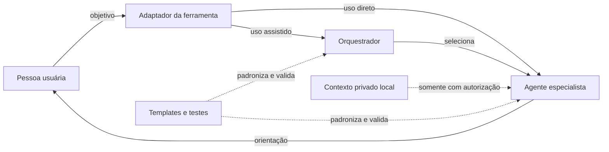

# Arquitetura do Personal AI Agents

O Personal AI Agents é uma biblioteca de agentes pessoais em Markdown. Não é uma
aplicação com backend: os arquivos definem comportamento, limites e formas de uso para
diferentes ferramentas de IA.

## Visão geral

A ferramenta de IA executa as instruções. A pessoa fornece o contexto, autoriza dados
privados e continua responsável pelas decisões.

## Componentes

| Componente | Responsabilidade |
|---|---|
| [[../agents/orquestrador-pessoal]] | identificar o objetivo e selecionar o especialista adequado |
| [[../agents/catalogo]] | listar especialidades e limites principais |
| `agents/*.md` | definir comportamento e guardrails de cada especialista |
| `AGENTS.md`, `CLAUDE.md` e `.github/` | adaptar o projeto às convenções de cada ferramenta |
| [[../adapters/instrucoes-genericas]] | permitir uso manual em qualquer ferramenta de IA |
| [[../context/contexto-pessoal.template]] | orientar a criação de contexto pessoal mínimo |
| [[../context/fonte-de-contexto.template]] | inventariar fontes privadas por especialidade |
| `.private/` | guardar contexto pessoal local e opcional, fora do Git |
| [[../sessions/registro-de-sessao.template]] | registrar decisões e continuidade entre sessões |
| [[../tests/README]] | definir casos e critérios de comportamento esperado |
| [[qualidade-e-evals]] | executar validação estática e avaliação comportamental reproduzível |

## Modos de uso

### Direto

A pessoa escolhe um especialista e carrega somente seu arquivo. É o modo mais simples
quando o domínio já está claro.

### Assistido

O orquestrador recebe o objetivo, seleciona o especialista principal e pode consultar
um complementar quando outro domínio realmente mudar a decisão.

### Com continuidade

A pessoa mantém registros privados e autoriza fontes específicas quando deseja retomar
decisões, comparar períodos ou acompanhar evolução. As fontes podem incluir planilhas,
resumos, exames organizados por data, metas, planos de estudo e sessões anteriores.

Se a ferramenta oferecer subagentes reais, o orquestrador pode delegar tarefas. Caso
contrário, a coordenação acontece na mesma conversa e deve ser apresentada dessa forma.

## Contexto privado

O uso de `.private/` é opcional. Na primeira experiência, o orquestrador informa que a
pessoa pode trabalhar sem histórico ou usar registros privados para continuidade.

Antes de qualquer leitura, o agente deve informar:

- arquivo ou conjunto de arquivos;
- finalidade;
- especialista que receberá o contexto;
- escopo e sessão da autorização.

A autorização não é permanente e não vale automaticamente para outro agente, finalidade
ou sessão. Estar listado no índice de fontes também não autoriza leitura.

`.private/` é ignorado pelo Git, mas não é criptografado. Dados pessoais devem ser
protegidos no dispositivo, nos backups e nas configurações de retenção da ferramenta de
IA. Senhas, tokens, chaves, códigos de acesso e identificadores completos não devem ser
armazenados no projeto.

Planilhas, relatórios e outros artefatos com dados pessoais devem permanecer em
`.private/` ou em armazenamento externo adequado. Veja
[[contexto-privado-e-continuidade]] e [[../SECURITY]].

## Princípios

- `portabilidade`: núcleo em Markdown e YAML simples;
- `independência`: agentes não dependem de um fornecedor de IA;
- `privacidade`: contexto mínimo e autorização explícita;
- `segurança`: guardrails proporcionais ao risco de cada especialidade;
- `autonomia`: a pessoa confirma decisões e ações relevantes;
- `rastreabilidade`: versões de agentes e casos de teste evoluem juntas.

## Limites

O projeto não fornece modelo de IA, backend, banco de dados, criptografia, sincronização
ou backup. Também não substitui profissionais habilitados nem controla memória, retenção
ou uso de dados pelas ferramentas externas.

## Validação e manutenção

O script `tests/validate.ps1` verifica agentes, frontmatter, versões, casos e links. O
workflow `.github/workflows/validate.yml` executa a validação em Windows, Linux e macOS.
Os mesmos casos Markdown alimentam a avaliação comportamental opcional; target, grader,
commit e repetições fazem parte da evidência. Nenhum eval lê `.private/`.

Ao alterar um agente, atualize sua versão e seus casos, preserve os guardrails e não
inclua dados pessoais reais. Pendências de release e divulgação ficam em
[[checklist-publicacao]].

## Referências

- [C4 Model](https://c4model.com/) — inspiração para o diagrama;
- [OWASP Top 10 for LLM and GenAI](https://genai.owasp.org/initiatives/top-10-for-llm-and-genai/) — referência de segurança.
