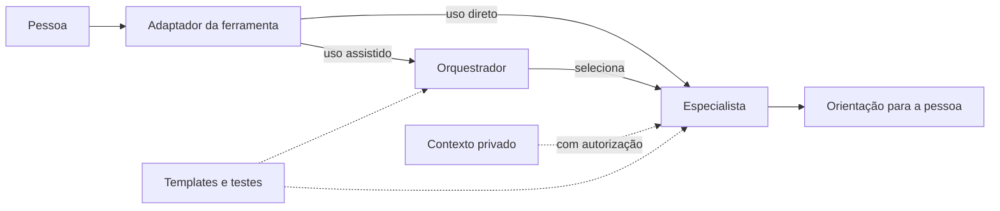

# Arquitetura do Personal AI Agents

O projeto é um conjunto de agentes em Markdown, não uma aplicação com backend. A ferramenta
de IA interpreta os arquivos; a pessoa fornece contexto, controla permissões e mantém a
decisão final.

## Visão geral

## Componentes

| Componente | Função |
|---|---|
| `agents/orquestrador-pessoal.md` | identificar o objetivo e selecionar o especialista |
| `agents/*.md` | definir especialidade, comportamento e guardrails |
| `AGENTS.md`, `CLAUDE.md` e `.github/` | adaptar a entrada às ferramentas compatíveis |
| `adapters/` | permitir uso manual em outras ferramentas de IA |
| `context/` e `sessions/` | oferecer modelos sem dados pessoais reais |
| `.private/` | guardar registros locais opcionais, fora do Git |
| `tests/` | validar estrutura e comportamento esperado |

## Fluxo

1. A pessoa descreve um objetivo ao orquestrador ou escolhe um especialista.
2. A ferramenta carrega somente as instruções necessárias.
3. Se houver contexto privado útil, o agente informa fonte, finalidade, escopo e sessão.
4. A pessoa autoriza, limita ou recusa a leitura.
5. O especialista responde com limites e origem do contexto preservados.

Se a ferramenta oferecer subagentes reais, o orquestrador pode delegar tarefas. Caso não
ofereça, ele coordena os especialistas na mesma conversa sem alegar execução inexistente.

## Modos de uso

- **Direto:** a pessoa escolhe um especialista.
- **Assistido:** o orquestrador seleciona o agente principal e, quando necessário, um
  complementar autorizado.
- **Com continuidade:** registros privados permitem comparar períodos e retomar decisões.

## Privacidade e segurança

O uso de `.private/` é opcional e nunca automático. A autorização vale apenas para as
fontes, finalidade, escopo e sessão informados. O diretório é ignorado pelo Git, mas não é
criptografado; proteção do dispositivo, backups e retenção da ferramenta continuam sob
responsabilidade da pessoa.

Os agentes não recebem credenciais, não executam transações e não substituem profissionais
habilitados. Guardrails são proporcionais ao risco de cada especialidade.

## Portabilidade e qualidade

O núcleo usa Markdown e frontmatter YAML simples, sem dependência de fornecedor. Cada
agente possui versão própria e cenários correspondentes. A validação estática roda em
Windows, Linux e macOS; a avaliação comportamental opcional registra modelo, grader,
commit e repetições. Nenhum teste lê `.private/`.

Detalhes de uso e manutenção:

- [[contexto-privado-e-continuidade]]
- [[qualidade-e-evals]]
- [[licoes-aprendidas-testes-agentes]]
- [[checklist-publicacao]]
- [[../SECURITY]]

## Limites

O projeto não fornece modelo de IA, backend, banco de dados, criptografia, sincronização ou
backup. O comportamento também depende do modelo, da ferramenta, do contexto e das
permissões disponíveis.
